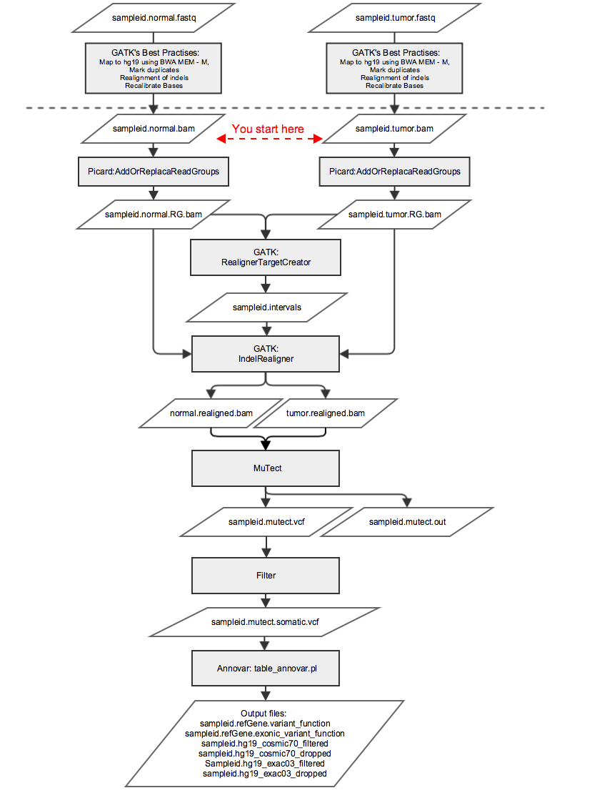

# Detection of somatic mutations in tumor samples
Malin Larsson  
malin.larsson@scilifelab.se  
Practical exercise in the course "Advanced Next Generation Sequencing data analysis" at University of Gothenburg, October 2015.  
## Introduction
In this exercise we will analyze somatic mutations in cancer, which is a bit different from the identification of inherited germline variants. We are only interested in the somatic mutations that have occurred during the development of tumor cells, so the beckground of germline variants (also present in the tumor cells) must be filtered away. Difficulties arise because tumor samples often contain a mixture of cancer cells and normal cells (Figure 1), tumors may consist of sub-clones with different somatic mutations and cancer cells may not be diploid due to copy number variation. Germline genotype callers such as GATK's HaplotypeCaller are optimized for diploid samples or samples of known ploidy, and for detecting variants with allele frequencies close to 0, 0.5 or 1. Therefore, somatic variants should be called with specialized callers.   
   
Figure 1: Illustration of the complexity of a tumor sample. Published by Hanahan and Weinberg, Hallmarks of Cancer: The Next Generation, Cell 2011  
  
A complete analysis of the genomic abberations in a tumor sample would include analysis of somatic single nucleotide variants (SNVs), structural variants (SVs) and copy number variants (CNVs). Several algorithms for detecting these types of somatic variation are available. Ambitious efforts have been made to compare the results of different somatic variant detection algorithms and propose a best practise work flow. Reports from these benchmarks are available here:   
http://www.nature.com/nmeth/journal/v12/n7/full/nmeth.3407.html   
http://www.nature.com/articles/ncomms10001  


## Part one - somatic SNV detection and annotation
Here you will use the algorithm MuTect1 to detect somatic single nucleotide variants (SNVs) in tumor samples, and annotate the detected variants with the algorithm Annovar. 
For this we will use whole genome sequence data of two cancer cell lines, as well as cell lines derived from normal tissue from the same donors. The data is part of a publicly available data set that has been used for benchmarking mutation detection algorithms.(https://www.synapse.org/#!Synapse:syn312572/wiki/58893 ) We will work with the two samples HCC1143 and HCC1954, both originating from ductal carcinoma of the breast. The corresponding normal samples HCC1143_BL and HCC1954_BL are derived from blood from the same individuals.  
Your analysis will be limited to a small region of chromosome 17 (17:1000000-9000000), simply because the entire genome would take days to analyze and the important thing is that you learn how to use the algorithms.  
You will start with .bam files that were generated according to GATK's best practice for variant discovery (tumor and normal .bam files were generated separately). 
## Part two - Whole genome data and effect of normal contamination
In the second part of the exercise, you will play with mutation data that have already been generated in the same way as in part one, but for the entire genome and for some additional samples. You will be provided somatic mutations detected in tumor samples with a varying amount of "normal contamination", so that you can see how sample purity affects the results of genotype calling.
##Further reading:
For information about MutTect,  Annovar, the dataset and GATK's best practice for variant discovery, please see  
MuTect: https:/www.broadinstitute.org/cancer/cga/mutect  
Annovar: http://annovar.openbioinformatics.org/en/latest/  
The data set: https://cghub.ucsc.edu/datasets/benchmark_download.html  
GATK: https://www.broadinstitute.org/gatk/guide/bp_step.php?p=1  


# Part one - somatic variant detection and annotation

## Analysis
You will perform the following steps:
-Add read group information to the .bam files
-Perform indel realignment simultaneously for the normal and tumor .bam files
-Run MuTect
-Filter the results so that only the most likely somatic variants are kept
-Annotate the filtered variants with RefSeq genes, Cosmic70 mutations and Exac03 variant using Annovar

Figure 1 shows an overview of the workflow of this part of the exercise. 

Start by running through the analysis for one sample, and save all commands to a text file. If you have time you can analyze the second sample as well in the end of the exercise (it will be faster this time since you have saved all commands).
   
Figure 1: Workflow of somatic variant detection and annotation.

## Data
Bam files are located here:
/home/teacher2/cancer_genomics_2015/data/chr17/HCC1143.normal.bam
/home/teacher2/cancer_genomics_2015/data/chr17/HCC1143.tumor.bam   
/home/teacher2/cancer_genomics_2015/data/chr17/HCC1954.normal.bam
/home/teacher2/cancer_genomics_2015/data/chr17/HCC1954.tumor.bam

### Include paths to software and reference files in your .bashrc
Define paths to the software, data and reference files used the exercise. This is done by inserting the following lines into your .bashrc file (located in your home directory):
```
#Tools for cancer_genomics_2015:
PICARD_HOME=/home/erik/bin/picard-tools-1.65
GATK_HOME=/home/marcela/bin/GATK
MUTECT_HOME=/home/marcela/bin
ANNOVAR_HOME=/home/teacher2/cancer_genomics_2015/annovar/
bundle=/home/teacher2/cancer_genomics_2015/bundle
data=/home/teacher2/cancer_genomics_2015/data
scripts_dir=/home/teacher2/cancer_genomics_2015/scripts
```  

When you have modified your .bashrc file, reload it with this command (this neads to be done in every open terminal window):  
```  
. ~/.bashrc  
```  

The bundle folder above contains reference files needed for the analyses and is distributed by the Broad Institute together with GATK. For more information, please see http://gatkforums.broadinstitute.org/discussion/1213/whats-in-the-resource-bundle-and-how-can-i-get-it


### Create working directory
Create a working directory for todays exercise and go there  
```  
mkdir cancer_dir
cd cancer_dir  
```  

### Create symbolic links to input bam files
If you start with the sample HCC1143:  
```  
ln -s $data/chr17/HCC1143.normal.bam HCC1143.normal.bam
ln -s $data/chr17/HCC1143.tumor.bam HCC1143.tumor.bam
```  

If you start with the sample HCC1954:  
```  
ln -s $data/chr17/HCC1954.normal.bam HCC1954.normal.bam
ln -s $data/chr17/HCC1954.tumor.bam HCC1954.tumor.bam
```  

### AddOrReplaceReadGroups
Use the Picard's method AddOrReplaceReadGroups to update the readgroup information in the tumor and normal bam files. AddOrReplaceReadGroups is distributed as jar file, started with this command:  
```  
java -jar $PICARD_HOME/AddOrReplaceReadGroups.jar
```  

If you start the program without input parameters, you will be provided with a help page that describes how to use the program and which options are available. 
Run the command separately for the tumor and the normal bam files. Call the respective output files something like "sampleid.normal.RG.bam"  (where sampleid = HCC1143 or HCC1954), to distinguish it from the original bam file. Also, specify the following options (exemplified with the normal sample, please replace sampleid with HCC1143 or HCC1954):  
```
RGID=sampleid.normal 
RGLB=sampleid.normal 
RGPU=sampleid.normal 
RGSM=sampleid.normal 
RGPL=ILLUMINA 
SORT_ORDER=coordinate 
CREATE_INDEX=True
```  

### Realign Indels
Use GATK to realign the tumor and normal .bam files simultaneously around potential insertions and deletions in the genome (indels). Firstly, you identify suspicious intervals that are likely in need of realignment using the method "RealignerTargetCreator". Secondly, you perform local realignment over those intervals using the method "IndelRealigner". 

RealignerTargetCreator is started with the following command:  
```
java -jar $GATK_HOME/GenomeAnalysisTK.jar -T RealignerTargetCreator
```  

IndelRealigner is started with the following command:  
```  
java -jar $GATK_HOME/GenomeAnalysisTK.jar -T IndelRealigner  
```  

To learn about the input and output options to GATK, type  
```  
java -jar $GATK_HOME/GenomeAnalysisTK.jar --help  
```  
or read about the specific tool, e.g. IndelRealigner on https://www.broadinstitute.org/gatk/guide/tooldocs/

For RealignerTargetCreator, please specify the following options:  
```
-R $bundle/human_g1k_v37.fasta 
-L 17:1000000-9000000 
-I sampleid.normal.RG.bam 
-I sampleid.tumor.RG.bam 
-known $bundle/1000G_phase1.indels.b37.vcf 
-known $bundle/Mills_and_1000G_gold_standard.indels.b37.vcf 
-o sampleid.intervals
```  

Where 
Sampleid = Either HCC1143 or HCC1954
sampleid.normal.RG.bam and sampleid.tumor.RG.bam are the normal and tumor .bam files generated in step 4 above. 
sampleid.intervals is the outoput of this command, containing coordinates of the suspicious regions that should be realigned.

For IndelRealigner please specify the following options:  
```
-R $bundle/human_g1k_v37.fasta 
-I sampleid.normal.RG.bam 
-I sampleid.tumor.RG.bam 
-targetIntervals sampleid.intervals 
-known $bundle/1000G_phase1.indels.b37.vcf  
-known $bundle/Mills_and_1000G_gold_standard.indels.b37.vcf  
-nWayOut ".realignedtogether.bam"
```  

Where 
Sampleid =  Either HCC1143 or HCC1954
sampleid.normal.RG.bam and sampleid.tumor.RG.bam are the normal and tumor .bam files generated in step 4 above. 
Sampleid.intervals is the interval file generated by RealignerTargetCreator above.
-nWayOut means that the reads in the different input files will be written to separate output files, with file names reflecting the input file names but with the extentions ".realignedtogether.bam"  
 
### Detect single nucleotide variants with MuTect
MuTect is distributed as a jar file just like Picard and GATK. To get help and learn about input options, type  
```
java -jar $MUTECT_HOME/muTect-1.1.5.jar -help
``` 

You should run MuTect with the following options:  
```
--analysis_type MuTect  
--reference_sequence $bundle/human_g1k_v37.fasta 
--cosmic $bundle/b37_cosmic_v54_120711.vcf 
--dbsnp $bundle/dbsnp_138.b37.vcf 
--intervals 17:1000000-9000000 
--input_file:normal sampleid.normal.RG.realignedtogether.bam 
--input_file:tumor sampleid.tumor.RG.realignedtogether.bam 
--out sampleid.mutect.out 
--vcf sampleid.mutect.vcf
```  

Where 
Sampleid =  Either HCC1143 or HCC1954
sampleid.normal.RG.realignedtogether.bam and sampleid.normal.RG.realignedtogether.bam are the output files of IndelRealigned above.
sampleid.mutect.out will contain the complete statistics for all potential SNVs detected with MuTect
sampleid.mutect.vcf will contain all potential SNVs in vcf format  

#### Tasks:
 Look at the file sampleid.mutect.out and try to understand what the different columns mean. You will probably find this link useful: http://gatkforums.broadinstitute.org/discussion/4231/what-is-the-output-of-mutect-and-how-should-i-interpret-it
 Also look at the file sampleid.mutect.vcf and try to understand on what format the genotype information is presented. Specifically - How is information about the number of reads supporting each allele of an SNV in the normal and tumor samples reported?

### Filter the detected mutations
The "raw variant calls" need to be filtered to remove false positives such as likely germline variants. MuTect includes a post-detection filtering step that classifies the detected variants into "likely somatic" or "likely false positives".
To extract the likely somatic variants from MuTect calls use:  
```
grep -v "REJECT" sampleid.mutect.vcf > sampleid.mutect.somatic.vcf
```  

Where sampleid.mutect.vcf is the unfiltered vcf file generated by MuTect in step 6 above, and sampleid.mutect.somatic.vcf is the filtered results. 
#### Tasks: 
 How many potential SNVs were detected in your sample before filtering?
 How many of these were judged to be somatic mutations by MuTect's post detection filter?

### Annotate the somatic SNVs using Annovar
Use the tool Annovar to link the somatic variants detected in your sample to genes in the refGene database, mutations in the Cosmic70 database and mutations in the Exac03 database.  Annovar is distributed as a set of perl script and data files. You should use the script table_annovar.pl to annotate your data with information from refGene, Cosmic70 and exac03 in one command. 
If you start table annovar without input parameters like this:  
```
$ANNOVAR_HOME/table_annovar.pl 
```  
you will be provided with help on how to use the script. 

Please use the following options to annotate your filtered vcf file:  
```
-buildver hg19 
-out sampleid 
-protocol refGene,exac03,cosmic70 
-operation g,f,f 
-nastring . 
-vcfinput
```  

and specify the location of the database for human sequences to:  
```
$ANNOVAR_HOME/humandb/
```  

#### Tasks:
 How many of filtered somatic variants in your samples are located in exons?
 How many of the filtered somatic variants are present in the Exac03 database?
 How many of the filtered somatic variants are present in the Cosmic70 database?
 Is any of the filtered somatic variant present in both the Cosmic70 and Exac03 databases?
 Are there any filtered somatic mutations in exons of the TP53 gene?


## Part two - Whole genome data
In this part of the exercise you will work with data that was generated exactly as above, but for the entire genome. The same samples (HCC1143 and HCC1954) have been analyzed, but in addition to the normal and the tumor we have included four known mixtures of normal and tumor DNA. All 6 samples are present in the same vcf files.  
### Data
Filtered somatic mutations are available in these files:  
```
$data/wgs/HCC1143.final.vcf
$data/data/wgs/HCC1954.final.vcf
``` 

Filtered somatic mutations annotated with Annovar and the refGene database, are available here:
```
$data/wgs/HCC1143.avinput.variant_function
$data/wgs/HCC1143.avinput.exonic_variant_function
$data/wgs/HCC1954.avinput.variant_function
$data/wgs/HCC1954.avinput.exonic_variant_function
```  

where  
```
$data=/home/teacher2/cancer_genomics_2015/data
```  

### Create symbolic links to input files  
```
ln -s $data/wgs/HCC1143.final.vcf  HCC1143.final.vcf
ln -s $data/data/wgs/HCC1954.final.vcf HCC1954.vcf
ln -s $data/wgs/HCC1143.avinput.variant_function \
HCC1143.avinput.variant_function
ln -s $data/wgs/HCC1143.avinput.exonic_variant_function \
HCC1143.avinput.exonic_variant_function
ln -s $data/wgs/HCC1954.avinput.variant_function \
HCC1954.avinput.variant_function
ln -s $data/wgs/HCC1954.avinput.exonic_variant_function \ HCC1954.avinput.exonic_variant_function
``` 

### check sample names  
The names of the samples in the vcf files reflect the fraction of normal and tumor DNA in the samples. Check the  sample names by typing  
```
grep "#^CHROM"  sampleid.final.vcf
```  
where sampleid should be HCC1143 or HCC1954

### Extract basing statistics
####Tasks
How many likely somatic mutations were detected with in the two tumors (HCC1143 and HCC1954)?
How many of these were located in exons?


### Normal contamination of the tumor samples
Now you will look at the distribution of alternative allele frequencies over all detected mutations, and see how it is affected by normal contamination in the tumor sample. In this situation, the alternative allele frequency is defined as:  

alt allele frequency =  (number of reads supporting the alternative allele)/(number of reads supporting the reference allele)  


Use the python script "vcf2freq.py" available in  
```
$scripts_dir (home/teacher2/scripts/cancer_genomics_2015/)
```  
to plot the distribution of alternative allele frequencies for all mutations in the six samples. The script generates a pdf file with plots of alternative allele frequency distributions for all samples in the input vcf, both in the form of box plots and as histograms. 
vcf2freq.py is started like this:  
```
$scripts_dir/vcf2freq.py sampleid.final.vcf out
```

Where sampleid is HCC1143 or HCC1954 and out is the root name of the output .pdf file. 
####Task
What are the median allele frequencies (approximately) in the different samples? 
Do the distributions of alternative allele frequencies fit with the proportions of tumor and normal DNA in the samples?

	
			
	


