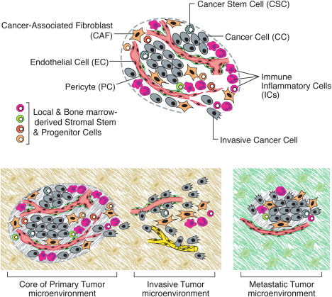

# Detection of somatic mutations in tumor samples
Malin Larsson  
malin.larsson@scilifelab.se  
Practical exercise given as part of the course "Advanced Next Generation Sequencing data analysis" at University of Gothenburg, October 2016.  

### Introduction
In this exercise we will analyze somatic mutations in cancer, which is a bit different from the identification of inherited germline variants. We are only interested in the somatic mutations that have occurred during the development of tumor cells, so the beckground of germline variants (also present in the tumor cells) must be filtered away. Difficulties arise because tumor samples often contain a mixture of cancer cells and normal cells (Figure 1), tumors may consist of sub-clones with different somatic mutations and cancer cells may not be diploid due to copy number variation. Germline genotype callers such as GATK's HaplotypeCaller are optimized for diploid samples or samples of known ploidy, and for detecting variants with allele frequencies close to 0, 0.5 or 1. Therefore, somatic variants should be called with specialized callers.   
   
Figure 1: Illustration of the complexity of a tumor sample. Published by Hanahan and Weinberg, Hallmarks of Cancer: The Next Generation, Cell 2011  

  
A complete analysis of the genomic abberations in a tumor sample would include analysis of somatic single nucleotide variants (SNVs), structural variants (SVs) and copy number variants (CNVs). Several algorithms for detecting these types of somatic variation are available. Different somatic variant detection algorithms have been compared in order to propose a best practise work flow. Reports from these benchmarks are available here:   
[http://www.nature.com/nmeth/journal/v12/n7/full/nmeth.3407.html](http://www.nature.com/nmeth/journal/v12/n7/full/nmeth.3407.html)  
[http://www.nature.com/articles/ncomms10001](http://www.nature.com/articles/ncomms10001)  

### Part one - somatic SNV detection and annotation
We will use the algorithm MuTect1 to detect somatic single nucleotide variants (SNVs) in tumor samples, and annotate the detected variants with the algorithm Annovar. 
For this we will use whole genome sequence data from two cancer cell lines, and from cell lines derived from normal tissue from the same donors. The data is part of a publicly available data set that has been used for benchmarking mutation detection algorithms. We will work with the two samples HCC1143.tumor and HCC1954.tumor, both originating from ductal carcinoma of the breast. The corresponding normal samples HCC1143.normal and HCC1954.normal are derived from blood from the same individuals.  
Your analysis will be limited to a small region of chromosome 17 (17:1000000-9000000), simply because the entire genome would take days to analyze and the important thing is that you learn how to use the algorithms.  
You will start with .bam files that were generated according to GATK's best practice for variant discovery (tumor and normal .bam files were generated separately). 

### Part two - Whole genome data and effect of normal contamination
In the second part of the exercise, you will play with mutation data that have already been generated in the same way as in part one, but for the entire genome and for some additional samples. You will be provided somatic mutations detected in tumor samples with a varying amount of "normal contamination", so that you can see how sample purity affects the results of genotype calling.

### Further reading:
For information about MutTect,  Annovar, the dataset and GATK's best practice for variant discovery, please see  
MuTect: [https:/www.broadinstitute.org/cancer/cga/mutect](https:/www.broadinstitute.org/cancer/cga/mutect)  
Annovar: [http://annovar.openbioinformatics.org/en/latest/](http://annovar.openbioinformatics.org/en/latest/)  
GATK: [https://www.broadinstitute.org/gatk/guide/bp_step.php?p=1](https://www.broadinstitute.org/gatk/guide/)  
The data set: [https://www.synapse.org/#!Synapse:syn312572/wiki/62018](https://www.synapse.org/#!Synapse:syn312572/wiki/62018)   
  
# Part one - somatic variant detection and annotation
You will perform the following steps:  

1. Add read group information to the .bam files  
1. Perform indel realignment simultaneously for the normal and tumor .bam files  
1. Run MuTect1  
1. Filter the results so that only the most likely somatic variants are kept
1. Annotate the filtered variants with RefSeq genes, Cosmic70 mutations and Exac03 variant using Annovar

Figure 2 shows an overview of the workflow of this part of the exercise. Start by running through the analysis for one of the samples, and save all commands to a text file. If you have time you can analyze the second sample as well in the end of the exercise (it will be faster this time since you have saved all commands).
  
   
Figure 2: Workflow of somatic variant detection and annotation.

### Data
Bam files are located here:  

```bash
/home/teacher2/cancer_genomics/data/chr17/HCC1143.normal.bam
/home/teacher2/cancer_genomics/data/chr17/HCC1143.tumor.bam
/home/teacher2/cancer_genomics/data/chr17/HCC1954.normal.bam
/home/teacher2/cancer_genomics/data/chr17/HCC1954.tumor.bam
```

### Include paths to software and reference files in your .bashrc
Define paths to the software, data and reference files used the exercise. This is done by inserting the following lines into your .bashrc file (located in your home directory):

```bash
#Tools for cancer genomics:
PICARD_HOME=/home/erik/bin/picard-tools-1.65
GATK_HOME=/home/marcela/bin/GATK
MUTECT_HOME=/home/marcela/bin
ANNOVAR_HOME=/home/teacher2/cancer_genomics/annovar/
bundle=/home/teacher2/cancer_genomics/bundle
data=/home/teacher2/cancer_genomics/data
scripts_dir=/home/teacher2/cancer_genomics/scripts
```

The folder "bundle" above contains reference files needed for the analyses and is distributed by the Broad Institute together with GATK. For more information, please see 
[http://gatkforums.broadinstitute.org/discussion/1213/whats-in-the-resource-bundle-and-how-can-i-get-it](http://gatkforums.broadinstitute.org/discussion/1213/whats-in-the-resource-bundle-and-how-can-i-get-it)

When you have modified your .bashrc file, reload it with this command (this neads to be done in every open terminal window):  

```bash
. ~/.bashrc
```  

### Create working directory
Create a working directory for todays exercise and go there  

```bash
mkdir cancer_dir
cd cancer_dir
```  

### Create symbolic links to input bam files
If you start with the sample HCC1143:  

```bash
ln -s $data/chr17/HCC1143.normal.bam HCC1143.normal.bam
ln -s $data/chr17/HCC1143.tumor.bam HCC1143.tumor.bam
```  

If you start with the sample HCC1954:  

```bash
ln -s $data/chr17/HCC1954.normal.bam HCC1954.normal.bam
ln -s $data/chr17/HCC1954.tumor.bam HCC1954.tumor.bam
```  

### AddOrReplaceReadGroups
You should use the Picard's method AddOrReplaceReadGroups to update the readgroup information in the tumor and normal bam files. Picard is a java program and AddOrReplaceReadGroups is started like this:   

```bash
java -jar $PICARD_HOME/AddOrReplaceReadGroups.jar
```  

When you start the program without input parameters as above, you will be provided with a help page that describes how to use the program and which paramter options that are available.  

Run AddOrReplaceReadGroups for the tumor and the normal bam files separately, and specify the paramter options listed below (please replace "sampleid" with "HCC1143" or "HCC1954", and "normal with "tumor" as apropriate). It is a good practise to give the output file a name that shows how it was created, for example adding "RG" to the original file name.   

```bash

java -jar $PICARD_HOME/AddOrReplaceReadGroups.jar INPUT=sampleid.normal.bam OUTPUT=sampleid.normal.RG.bam RGID=sampleid.normal RGLB=sampleid.normal RGPU=sampleid.normal RGSM=sampleid.normal RGPL=ILLUMINA SORT_ORDER=coordinate CREATE_INDEX=True
```  

### Realign Indels
Now you should use GATK to realign the tumor and normal .bam files simultaneously around potential insertions and deletions in the genome (indels). Firstly, you should identify suspicious intervals that are likely in need of realignment using the method "RealignerTargetCreator". Secondly, you should perform local realignment over those intervals using the method "IndelRealigner".  
To get instructions on how to use RealignerTargetCreator, please type:  

```bash
java -jar $GATK_HOME/GenomeAnalysisTK.jar -T RealignerTargetCreator --help
```  

To get instructions on how to use IndelRealigner, please type:  

```bash  
java -jar $GATK_HOME/GenomeAnalysisTK.jar -T IndelRealigner --help
```  

For more inforamtion please read about the specific GATK tools on https://www.broadinstitute.org/gatk/guide/tooldocs/  

Run RealignerTargetCreator with the following options:  

```bash
java -jar $GATK_HOME/GenomeAnalysisTK.jar -T RealignerTargetCreator -R $bundle/human_g1k_v37.fasta -L 17:1000000-9000000 -I sampleid.normal.RG.bam -I sampleid.tumor.RG.bam -known $bundle/1000G_phase1.indels.b37.vcf -known $bundle/Mills_and_1000G_gold_standard.indels.b37.vcf -o sampleid.intervals
```  

Where   
"sampleid" should be replaced with "HCC1143" or "HCC1954"  
sampleid.normal.RG.bam and sampleid.tumor.RG.bam are the normal and tumor .bam files generated in the AddOrReplaceReadgroups step above.   
sampleid.intervals is the outoput of RealignerTargetCreator, containing coordinates of the suspicious regions that should be realigned.  

Then run IndelRealigner with the following options:  

```bash
java -jar $GATK_HOME/GenomeAnalysisTK.jar -T IndelRealigner -R $bundle/human_g1k_v37.fasta -I sampleid.normal.RG.bam -I sampleid.tumor.RG.bam -targetIntervals sampleid.intervals -known $bundle/1000G_phase1.indels.b37.vcf -known $bundle/Mills_and_1000G_gold_standard.indels.b37.vcf -nWayOut ".realignedtogether.bam"
```  

Where   
"sampleid" should be replaced with "HCC1143" or "HCC1954"  
sampleid.normal.RG.bam and sampleid.tumor.RG.bam are the normal and tumor .bam files generated in the AddOrReplaceReadgroups step above. 
Sampleid.intervals is the interval file generated by RealignerTargetCreator above.  
-nWayOut means that the reads in the different input files will be written to separate output files, with file names reflecting the input file names but with the extentions ".realignedtogether.bam"  

### Detect single nucleotide variants with MuTect
MuTect is distributed as a jar file just like Picard and GATK. To get help and learn about input options, type  

```bash
/home/babak/bin/MCR_8.0/sys/java/jre/glnxa64/jre/bin/java -jar $MUTECT_HOME/muTect-1.1.4.jar -help
``` 

You should run MuTect with the following options:  

```bash
/home/babak/bin/MCR_8.0/sys/java/jre/glnxa64/jre/bin/java -jar $MUTECT_HOME/muTect-1.1.4.jar --analysis_type MuTect --reference_sequence $bundle/human_g1k_v37.fasta --cosmic $bundle/b37_cosmic_v54_120711.vcf --dbsnp $bundle/dbsnp_138.b37.vcf --intervals 17:1000000-9000000 --input_file:normal sampleid.normal.RG.realignedtogether.bam --input_file:tumor sampleid.tumor.RG.realignedtogether.bam --out sampleid.mutect.out --vcf sampleid.mutect.vcf
```  

Where   
"sampleid" should be replaced with "HCC1143" or "HCC1954"  
sampleid.normal.RG.realignedtogether.bam and sampleid.normal.RG.realignedtogether.bam are the output files of IndelRealigned above.  
Note that we are using a specific installation of Java for the MuTect call!

The output file sampleid.mutect.vcf will contain all potential SNVs in vcf format.  
The output file sampleid.mutect.out will contain the complete statistics for all potential SNVs detected with MuTect. The different columns of the file are described in this link:
[http://gatkforums.broadinstitute.org/discussion/4231/what-is-the-output-of-mutect-and-how-should-i-interpret-it](http://gatkforums.broadinstitute.org/discussion/4231/what-is-the-output-of-mutect-and-how-should-i-interpret-it)    

### Look at the MuTect output in vcf format
Remember that a vcf file conains meta information in lines starting with "##", a header line starting with "#CHROM", and data lines containing the genetic variants. A detaileld description of the VCF format can be found here: 
[http://samtools.github.io/hts-specs/VCFv4.2.pdf](http://samtools.github.io/hts-specs/VCFv4.2.pdf)  

### Questions:
1\. What columns do the header line of your sampleid.mutect.vcf file contain?  
2\. What is the format of the genotype fields in your sampleid.mutect.vcf file?  
3\. Where in the sampleid.mutect.vcf file can you find information about the number of reads supporting each allele of specific SNV in a specific sample?    

### Filter the detected mutations
The "raw mutect calls" need to be filtered to remove false positives such as likely sequencing errors, and the germline variants of the sample. MuTect includes a post-detection filtering step that classifies the detected variants into "likely somatic" or "likely false positives". To extract the likely somatic variants from MuTect calls use:  

```bash
grep -v "REJECT" sampleid.mutect.vcf > sampleid.mutect.somatic.vcf
```

Where sampleid.mutect.vcf is the unfiltered vcf file generated by MuTect, and sampleid.mutect.somatic.vcf is the filtered results. 

### Questions:
4\. How many unfiltered SNVs were detected by MuTect1?  
For the small region that we are working on it is possible to open the .vcf file in Excel and count the number of SNV lines. However, this would not be possible if you worked with a full genome. Now use the following combination of the linux commands "grep" and "wc" to answer the same question: 

```bash
grep "^17" sampleid.mutect.vcf | wc
```

5\. Use a similar command to find out how many lines of metadata the sampleid.mutect.vcf file contains (including the header line). Hint: The "^" sign in the command above means that we are looking for lines that starts with the number "17". Now you should count the lines that starts with "#".  
6\. How many of the SNVs in the sampleid.mutect.vcf were judged to be somatic by MuTects's post detection filter?   

### Look at the filtetred mutations in IGV
You should now use IGV to visualize a few of the somatic mutations. To make the visualization in IGV faster, please copy the data files to your local computer and run IGV there. In your local computer:

```bash
scp username@rudy.biomedicine.gu.se:/path/to/your/cancer_dir/sampleid.mutect.somatic.vcf .
scp username@rudy.biomedicine.gu.se:/path/to/your/cancer_dir/sampleid.normal.RG.realignedtogether.bam .
scp username@rudy.biomedicine.gu.se:/path/to/your/cancer_dir/sampleid.normal.RG.realignedtogether.bai .
scp username@rudy.biomedicine.gu.se:/path/to/your/cancer_dir/sampleid.tumor.RG.realignedtogether.bam .
scp username@rudy.biomedicine.gu.se:/path/to/your/cancer_dir/sampleid.tumor.RG.realignedtogether.bai .
```

Open the .vcf file and the tumor and normal .bam files in your local IGV. For instructions on how to use IGV, please look at yesterdays exercise:[http://bio.biomedicine.gu.se/~marcela/courses/2016/exome/visualization.html](http://bio.biomedicine.gu.se/~marcela/courses/2016/exome/visualization.html)  
Zoom in and look at the region on Chromosome 17 that we have data for. This can be done by pasting 17:1000000-9000000 into the IGV search window and press "Go".  
Brows around and zoom into one or a few of the somatic mutations. By hoovering the mouse over a mutation you can see the number of alternative alleles in the normal and tumor samples respectively (this is done by hoovering on the row that corresponds to the sampleid.normal and sampleid.tumor respectively). Note down one mutated position and look at the corresponding mutation in the vcf file using this command:  

```bash
grep 'position' sampleid.mutect.somatic.vcf
```

Try to find a mutation that has an even ditribution of alternatve and reference alleles in the tumor sample. Zoom in on this position until you are at base-resolution so that you can see witch reads contain the alternative- and reference alleles. 

### Annotate the somatic SNVs using Annovar
Use the tool Annovar to link the somatic variants detected in your sample to genes in the refGene database, mutations in the Cosmic70 database and mutations in the Exac03 database.  Annovar is distributed as a set of perl script and data files. You should use the script table_annovar.pl to annotate your data with information from refGene, Cosmic70 and exac03 in one command. 
If you start table annovar without input parameters like this:  

```bash
$ANNOVAR_HOME/table_annovar.pl 
```  

you will be provided with help on how to use the script. 
Please use the following command to annotate your filtered vcf file:  

```bash
$ANNOVAR_HOME/table_annovar.pl -buildver hg19 -out sampleid -protocol refGene,exac03,cosmic70 -operation g,f,f -nastring . -vcfinput sampleid.mutect1.somatic.vcf $ANNOVAR_HOME/humandb/
```  

Where "sampleid" should be replaced with "HCC1143" or "HCC1954". The path to $ANNOVAR_HOME/humandb/ should be provided in the end of the command since that directory contains all data files used for annotation.  
The output file 

### Questions:
Answer the questions below using a combination of the commands "grep" "|" and "wc":  
7\. How many of filtered somatic variants in your samples are located in exons?  
8\. How many of the filtered somatic variants are present in the Exac03 database?  
9\. How many of the filtered somatic variants are present in the Cosmic70 database?  
10\. Is any of the filtered somatic variant present in both the Cosmic70 and Exac03 databases?  
11\. Both samples "HCC1143" and "HCC1954" should have somatic mutations in exons of the TP53 gene. Extract the data for this mutation using 

```bash
grep "Gene.refGene=TP53" sampleid.hg19_multianno.vcf
```

Does the TP53 mutation alter the aminoaccid sequence of the protein?  
12\. How many reads of the TP53 mutations supports the alternative and reference alleles respectively in your sample? Please visualize this by looking at the mutation in IGV.  
13\. Based on the allele frequencies of the TP53 mutations, what fraction of the cells in the tumor sample appear to have this mutation?

# Part two - Whole genome data
In this part of the exercise you will work with data that was generated exactly as above, but for the entire genome. The same samples (HCC1143 and HCC1954) have been analyzed, but in addition to the normal and the tumor we have included four known mixtures of normal and tumor DNA. All 6 samples are present in the same vcf files.  

### Data
Filtered somatic mutations are available in these files:  

```bash
$data/wgs/HCC1143.final.vcf
$data/wgs/HCC1954.final.vcf
``` 

Filtered somatic mutations annotated with Annovar and the refGene database, are available here:

```bash
$data/wgs/HCC1143.avinput.variant_function
$data/wgs/HCC1143.avinput.exonic_variant_function
$data/wgs/HCC1954.avinput.variant_function
$data/wgs/HCC1954.avinput.exonic_variant_function
```  

where  

```bash
$data=/home/teacher2/cancer_genomics/data
```  

### Create symbolic links to input files  

```bash
ln -s $data/wgs/HCC1143.final.vcf  HCC1143.final.vcf
ln -s $data/data/wgs/HCC1954.final.vcf HCC1954.vcf
ln -s $data/wgs/HCC1143.avinput.variant_function HCC1143.avinput.variant_function
ln -s $data/wgs/HCC1143.avinput.exonic_variant_function HCC1143.avinput.exonic_variant_function
ln -s $data/wgs/HCC1954.avinput.variant_function HCC1954.avinput.variant_function
ln -s $data/wgs/HCC1954.avinput.exonic_variant_function HCC1954.avinput.exonic_variant_function
``` 

### Genome wide detection of somatic mutations  
The names of the samples in the vcf files reflect the fraction of normal and tumor DNA in the samples. Check the  sample names by looking in the header line of the fina vcf file:   

```bash
grep "^#CHROM"  sampleid.final.vcf
```  
where sampleid should be HCC1143 or HCC1954

### Questions
Answer the following questions using a combination of the commands "grep", "|” and "wc":  
14\. How many likely somatic mutations were detected in the two tumor genomes (HCC1143 and HCC1954)?  
15\. How many of these were located in exons?  

### Normal contamination of the tumor samples
Now you will look at the distribution of alternative allele frequencies over all detected mutations, and see how it is affected by normal contamination in the tumor sample. In this situation, the alternative allele frequency is defined as:  
alt allele frequency =  (number of reads supporting the alternative allele)/(number of reads supporting the reference allele)  
Use the python script "vcf2freq.py" available in $scripts_dir (home/teacher2/scripts/cancer_genomics/) to plot the distribution of alternative allele frequencies for all mutations in the six samples. The script generates a pdf file with plots of alternative allele frequency distributions for all samples in the input vcf, both in the form of box plots and as histograms. 
vcf2freq.py is started like this:  

```bash
$scripts_dir/vcf2freq.py sampleid.final.vcf out
```

Where sampleid is HCC1143 or HCC1954 and out is the root name of the output .pdf file. 

### Questions
16\. What are the median allele frequencies (approximately) in the different subsamples?  
17\. Why do you think that the median alternative allele frequency in the undiluted tumor sample (sampleid_tumor) is lower than 0.5? There are multiple possible answers, but please discuss possible scenarios.  
18\. Do the distributions of alternative allele frequencies in the different samples fit with the proportions of tumor and normal DNA in the samples?  

# Assignment to pass the course
Please hand in answers to questions 2, 3, 11, 12 and 16 via GUL.   

	
			
	


